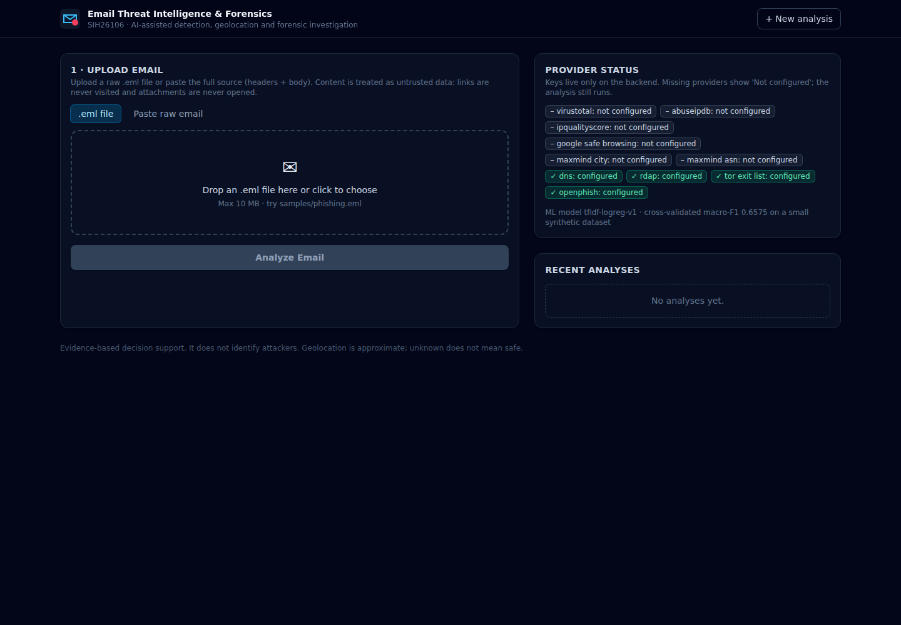
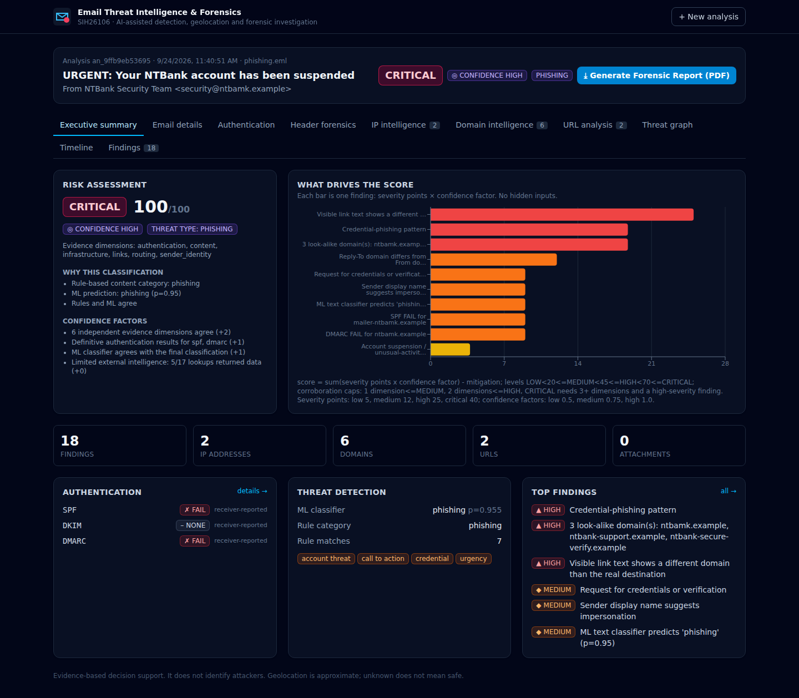
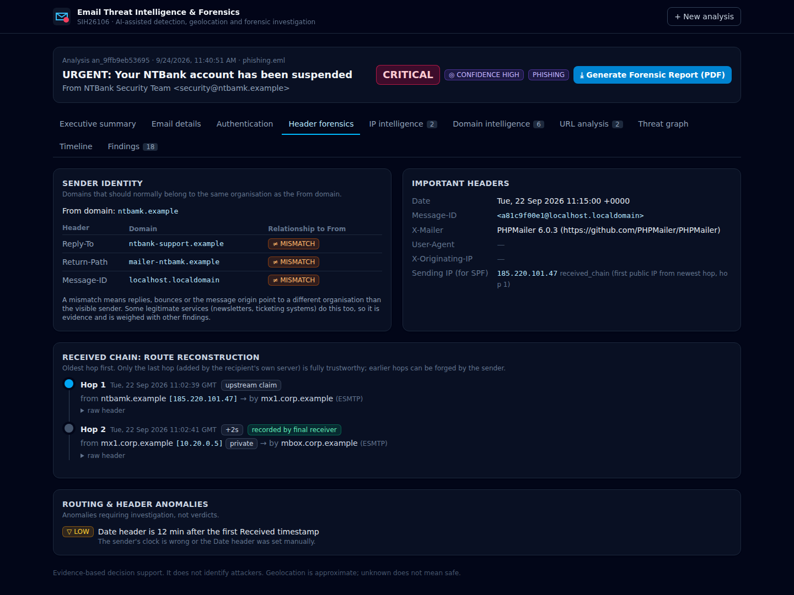
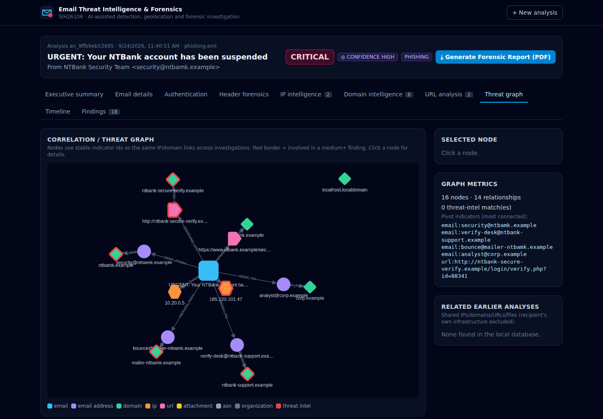

# SIH26106 — AI-Powered Email Threat Detection, GeoLocation and Forensic Intelligence Platform

A working end-to-end prototype of **AI-assisted email threat detection and forensic investigation**.
Upload a raw `.eml` file and one **Analyze Email** action runs the complete workflow:

```
Email input → 1 Collection → 2 Threat detection (rules + ML) → 3 Header & email forensics (SPF/DKIM/DMARC,
Received chain) → 4 IP & domain intelligence (VirusTotal, AbuseIPDB, IPQualityScore, MaxMind, DNS, RDAP)
→ 5 Correlation / threat graph → 6 Risk & forensic intelligence → 7 Forensic PDF report → Analyst dashboard
```

The system presents **evidence, relationships, infrastructure intelligence and a transparent risk
assessment**. It does not "identify the attacker". Geolocation is approximate, threat intelligence
is incomplete, and *unknown never means safe*.

| Upload | Executive summary |
| --- | --- |
|  |  |
| **Header forensics** | **Threat graph** |
|  |  |

*(Screenshots taken in zero-API-key mode with `samples/phishing.eml`.)*

---

## Features

| Stage | What it does |
| --- | --- |
| **Email collection** | Parses `.eml` / raw text with the stdlib `email` package: From/To/Cc/Subject/Date/Message-ID/Reply-To/Return-Path, Received, Authentication-Results, DKIM-Signature, MIME tree, text + HTML bodies, URLs (text, `href`, visible link text), attachments (name, MIME, size, SHA-256, magic bytes). Email SHA-256 recorded. Nothing is executed, rendered or fetched. |
| **Threat detection** | 17 transparent regex rules (urgency, account threat, credential/OTP request, password reset, payment/bank change/gift cards, secrecy/authority, CTA, reward, intimidation) with negation handling + display-name impersonation checks + a **TF-IDF + Logistic Regression** classifier (legitimate / phishing / spoofing / BEC / suspicious) returning class probabilities and influential terms. |
| **Header forensics** | Received-chain reconstruction (oldest → newest, hop IP/host/server/protocol/timestamp/Δt, trust level), routing anomalies, sending-IP selection, **SPF** (pyspf), **DKIM** (dkimpy, real signature verification), **DMARC** (policy + relaxed/strict SPF/DKIM alignment), receiver-recorded Authentication-Results (trusted only if added by the final receiving server), From/Reply-To/Return-Path/Message-ID/DKIM-d mismatches, suspicious X-Mailer, missing/encoded headers. |
| **IP & domain intelligence** | Common provider interface with normalised results and statuses (`success`, `skipped`, `unknown`, `rate_limited`, `unavailable`, `error`). IPs: MaxMind GeoLite2 (city/lat-long/ASN, offline), AbuseIPDB, VirusTotal, **IPQualityScore** (VPN, proxy, Tor, active VPN/Tor, connection type, recent abuse; `fraud_score` stored but never used as our score), Tor exit list. Domains: A/AAAA/MX/NS/TXT/CNAME, SPF/DMARC records, RDAP registration (creation date, age, registrar), VirusTotal, look-alike detection. URLs: structure analysis (IP-based, punycode, `@`, display-text mismatch, brand in subdomain, ports, keywords…), OpenPhish, Google Safe Browsing (optional), VirusTotal. |
| **Caching** | SQLite `provider_cache` with TTLs, negative caching for "not found", `provider_state` backoff after quota exhaustion, per-analysis budgets for VirusTotal/IPQS, one retry on timeout/5xx. |
| **Correlation** | NetworkX graph with stable ids (`email:user@x`, `domain:x`, `ip:x`, `url:…`, `file:<sha256>`, `asn:`, `org:`, `ti:`) and relations SENT_FROM, REPLY_TO, RETURN_PATH, USES_DOMAIN, ROUTED_THROUGH, RESOLVES_TO, CONTAINS_URL, HOSTED_BY, ASSOCIATED_WITH, CONTAINS_ATTACHMENT, MATCHES_THREAT_INTEL, SEEN_IN (cross-email correlation with earlier analyses, recipient's own infrastructure excluded). |
| **Risk & forensic intelligence** | Every finding has id, category, severity, confidence, title, description, why-it-matters, typed evidence (observed fact / analytical finding / threat-intel result), sources, related indicators. Transparent scoring with **corroboration caps** (one evidence dimension ≤ MEDIUM; CRITICAL needs ≥ 3 dimensions), confidence LOW/MEDIUM/HIGH with listed factors, and an explained classification. |
| **Timeline** | Email timeline (Date header + every hop) and investigation timeline (every stage with UTC timestamps). |
| **Report** | ReportLab PDF with 14 sections, each labelled OBSERVED FACT / ANALYTICAL FINDING / THREAT INTELLIGENCE RESULT, plus limitations. |
| **Dashboard** | React + Vite + Tailwind SOC-style UI: upload, progress, executive summary with score-driver chart (Recharts), email details, authentication, header forensics timeline, IP intelligence + Leaflet map, domains, URLs, interactive Cytoscape threat graph, timelines, filterable findings, PDF download. Status is always shown as text, not colour alone. |

## Architecture

See **[docs/architecture.md](docs/architecture.md)** for the full workflow, data contract, provider design and risk method.

```
SIH26106-Email-Threat-Intelligence/
├── backend/
│   ├── app/
│   │   ├── main.py                 FastAPI app factory
│   │   ├── api/routes.py           REST endpoints
│   │   ├── core/                   config (.env), logging, DNS wrapper, helpers
│   │   ├── database/               SQLAlchemy engine + 13 tables
│   │   ├── schemas/report.py       AnalysisReport contract (Pydantic, schema 1.0)
│   │   ├── providers/              base.py (interface, cache, backoff) + virustotal, abuseipdb, ipqs, maxmind, rdap, feeds
│   │   └── services/
│   │       ├── email_parser/       parser, URLs, attachments
│   │       ├── threat_detection/   rules, ML model + synthetic dataset
│   │       ├── header_forensics/   Received chain, SPF/DKIM/DMARC, identity
│   │       ├── ip_domain_intelligence/  indicators, URL analysis, intelligence
│   │       ├── correlation/        NetworkX threat graph
│   │       ├── risk_engine/        transparent risk + confidence
│   │       ├── reporting/          PDF report
│   │       └── pipeline.py         the integrated workflow
│   ├── tests/                      54 offline tests (all external services mocked)
│   ├── requirements.txt
│   └── .env.example
├── frontend/                       React + Vite + Tailwind dashboard
├── samples/                        5 synthetic demo emails + generator
└── docs/architecture.md
```

## Setup

**Requirements:** Python **3.11+**, Node.js **18+** (tested with Python 3.11.15 and Node 22).

### Backend

```bash
cd backend
python3 -m venv .venv
source .venv/bin/activate            # Windows: .venv\Scripts\activate
pip install -r requirements.txt
cp .env.example .env                 # optional: add API keys
uvicorn app.main:app --reload --port 8000
```

API docs: <http://localhost:8000/docs>. The SQLite database and generated PDFs go to `backend/data/`.

### Frontend

```bash
cd frontend
npm install
npm run dev                          # http://localhost:5173 (proxies /api to :8000)
```

Production build: `npm run build` (static files in `frontend/dist`; set `VITE_API_BASE` if the API is on another origin and add that origin to `CORS_ORIGINS`).

### Analyze a sample email

1. Open <http://localhost:5173>.
2. Drop `samples/phishing.eml` on the upload box → **Analyze Email**.
3. Browse the tabs; click **Generate Forensic Report (PDF)**.

Or from the command line:

```bash
curl -F "file=@samples/phishing.eml" http://localhost:8000/api/analyze/email | python -m json.tool | head -50
```

| Sample | What it demonstrates | Result in zero-key mode |
| --- | --- | --- |
| `legitimate.eml` | Genuine bank notification, DKIM-signed, aligned authentication | LOW |
| `phishing.eml` | Look-alike domain, Reply-To mismatch, SPF/DMARC fail, credential lure, display-text link trick, PHPMailer | CRITICAL (phishing) |
| `spoofing.eml` | Exact bank domain spoofed from a VPS, forged DKIM signature, forged older Received hop (timestamp anomaly) | HIGH (spoofing) |
| `bec.eml` | CEO impersonation from free webmail, **SPF/DMARC pass**, payment + secrecy request, Reply-To to another mailbox | HIGH (BEC) |
| `suspicious_url.eml` | IP-based URL on a non-standard port, punycode, `@` trick, brand in subdomain, `.pdf.js` and `.docm` attachments | CRITICAL |

All samples are synthetic (see [samples/README.md](samples/README.md)).

## Environment variables / API keys

All keys are **optional** and used **only by the backend**; the React app never sees them.

| Variable | Provider | Free tier (check provider site) | Without it |
| --- | --- | --- | --- |
| `VIRUSTOTAL_API_KEY` | VirusTotal v3 | 4 req/min, 500/day, non-commercial | VT results "Not configured" |
| `ABUSEIPDB_API_KEY` | AbuseIPDB v2 | 1,000 checks/day | no abuse score |
| `IPQS_API_KEY` | IPQualityScore proxy/VPN | 1,000 lookups/month; `active_vpn`/`active_tor`/`bot_status`/`abuse_velocity` are premium | VPN/proxy show UNKNOWN; Tor still from the Tor exit list |
| `GOOGLE_SAFE_BROWSING_API_KEY` | Safe Browsing v4 Lookup | free (Google Cloud project) | not queried |
| `MAXMIND_CITY_DB_PATH` / `MAXMIND_ASN_DB_PATH` | GeoLite2 `.mmdb` files | free account + license key to download | no city/coordinates → no map pins |

Other settings (budgets, TTLs, timeouts, `PROTECTED_DOMAINS`, `ENABLE_DNS/RDAP/PUBLIC_FEEDS`, `MAX_UPLOAD_MB`) are documented in [backend/.env.example](backend/.env.example).
MaxMind: create a free account at maxmind.com, download **GeoLite2-City** and **GeoLite2-ASN** (`.mmdb`) and place them in `backend/data/`.

### What works with zero API keys

Email parsing · header analysis · Received chain · URL extraction · attachment analysis · SPF/DKIM/DMARC (live DNS) ·
DNS intelligence · RDAP registration data · Tor exit list · OpenPhish feed · look-alike detection · rule engine ·
ML classifier · threat graph · cross-email correlation · risk & confidence · timeline · dashboard · PDF report.
Keyed providers show **"Not configured"** and never break the analysis.

## API endpoints

| Method | Path | Description |
| --- | --- | --- |
| POST | `/api/analyze/email` | multipart `file` (.eml) **or** form field `raw_email`; runs the full pipeline, returns the AnalysisReport |
| GET | `/api/analysis/{analysis_id}` | stored AnalysisReport (the stable contract for other modules) |
| GET | `/api/analyses` | recent analyses (id, subject, sender, risk, classification) |
| GET | `/api/analysis/{analysis_id}/graph` | correlation graph `{nodes, edges, metrics, related_analyses}` |
| GET | `/api/analysis/{analysis_id}/timeline` | email + investigation timeline |
| GET | `/api/analysis/{analysis_id}/report` | forensic PDF |
| GET | `/api/health` | status + which providers are configured (booleans only) |
| GET | `/api/model` | ML model info and cross-validated metrics |

Errors: 400 no input, 413 larger than `MAX_UPLOAD_MB`, 422 not an email, 404 unknown id.

## Tests

```bash
cd backend && source .venv/bin/activate && python -m pytest
```

54 tests cover parsing, header/Received parsing, SPF mapping, **real DKIM sign/verify/tamper**, DMARC alignment, mismatches,
URL/IP/domain extraction, attachments, rules + negation, the ML model and its metrics, IPQS/VT/AbuseIPDB mapping,
missing keys, quota exhaustion + backoff, HTTP 429, timeouts + retry, 5xx, bad JSON, caching, budgets, key redaction in logs,
signal merging, graph relations, risk caps, all API endpoints, PDF generation and a provider-layer crash.
DNS, SPF and HTTP are faked, so **no API keys or internet access are needed**.

## ML model

TF-IDF (1–2-grams) + Logistic Regression trained at startup on
[`training_emails.csv`](backend/app/services/threat_detection/data/training_emails.csv): **105 hand-written synthetic
texts**, 5 classes. `/api/model` reports metrics computed by 5-fold stratified cross-validation on that dataset
(currently accuracy ≈ 0.66, macro-F1 ≈ 0.66). These numbers only show the pipeline works; they are **not** real-world
accuracy. The classifier is one supporting signal, and the risk engine never relies on it alone.

## Limitations

- Evidence-based decision support; it does not attribute attacks to people.
- Geolocation is approximate infrastructure location; VPN/proxy/Tor/new domain/foreign country are indicators, never verdicts.
- Threat-intel coverage is partial and can be stale; `unknown`/`no detections` ≠ safe. Free tiers are small (see budgets).
- SPF/DKIM/DMARC are re-checked against **current** DNS; results may differ from delivery time, so receiver-recorded results are shown alongside and used as a fallback only when trusted.
- Received hops before the recipient's own servers can be forged.
- No sandboxing: URLs are never visited and attachments never opened (safe, but payload behaviour is not analysed). `.msg` (Outlook binary) files are not supported; export as `.eml`.
- The ML model is trained on a tiny synthetic dataset.
- Synchronous analysis (a few seconds per email; longer with many uncached keyed lookups). No authentication/multi-user support.

## Future improvements

Larger labelled training corpus (and optional transformer model) · MISP/URLhaus/PhishTank integration · dnstwist
typosquat generation · sandbox detonation integration · background job queue · PostgreSQL + Neo4j for campaign-scale
graphs · analyst accounts and case management · IMAP/Graph API mailbox collection · STIX 2.1 export.
