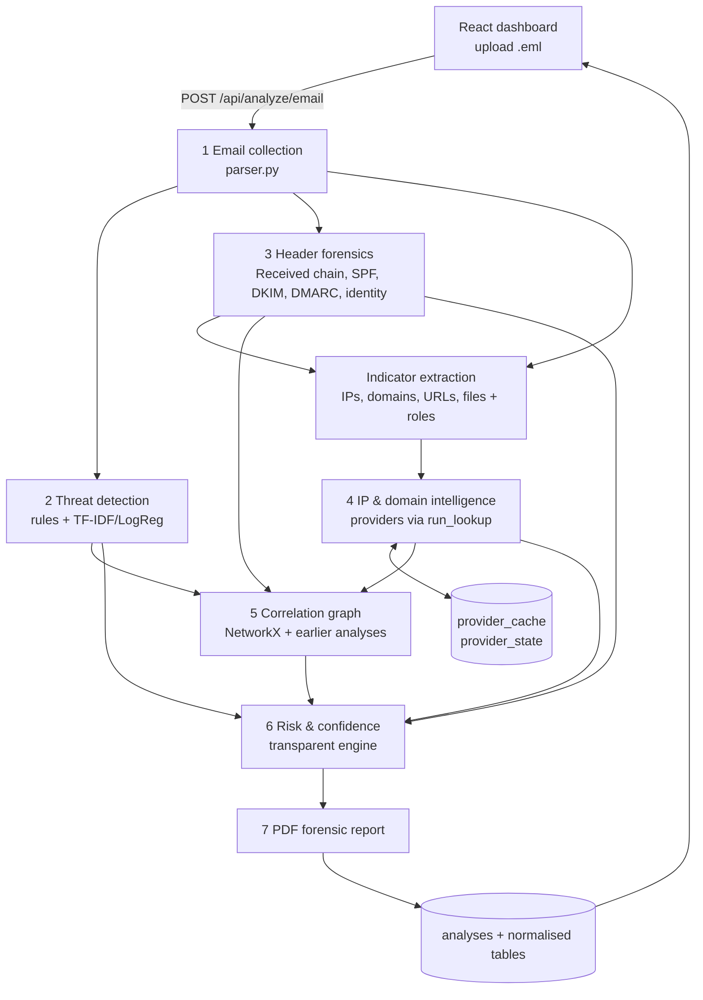

# Architecture

One FastAPI backend runs an integrated pipeline; the output of each stage is the input of the next.
The result is one **AnalysisReport** (schema 1.0) that is stored in SQLite, drawn by the React
dashboard, rendered into the PDF report and available to other team modules through the API.

## 1. Workflow



| Stage | Module | Input | Output |
| --- | --- | --- | --- |
| Collection | `services/email_parser/` | raw bytes | headers, bodies, URLs, attachments (hashed), SHA-256 |
| Threat detection | `services/threat_detection/` | subject + body text, From | rule matches, rule category, ML class + probabilities, findings |
| Header forensics | `services/header_forensics/` | parsed email + raw bytes | hops, anomalies, sending IP, SPF/DKIM/DMARC, identity comparisons, findings |
| Indicators | `ip_domain_intelligence/indicators.py` | parsed + header result | IPs/domains/URLs/addresses/files with **roles** and stable ids |
| Intelligence | `ip_domain_intelligence/intelligence.py` | indicators | DNS, RDAP, per-provider results, merged IP view, URL analysis, findings |
| Correlation | `services/correlation/graph.py` | all of the above | nodes, edges, metrics, related earlier analyses, findings |
| Risk | `services/risk_engine/engine.py` | all findings | level, score, confidence, classification, reasons, contributions |
| Report | `services/reporting/pdf_report.py` | AnalysisReport | PDF |

Every stage after parsing is wrapped so that a failure is logged, recorded in the timeline with status
`error`, and replaced by an empty result; the rest of the analysis still completes.

## 2. Provider architecture

```
Provider.fetch(client, type, value) -> ProviderResult     # one API call, provider-specific
run_lookup(provider, type, value, ctx)                    # shared behaviour, written once:
    unsupported type / private IP        -> skipped
    no API key                           -> skipped   ("Not configured")
    rate limited earlier in analysis     -> rate_limited
    provider_state backoff active        -> rate_limited (provider_backoff)
    fresh cache hit                      -> cached result
    per-analysis budget used up          -> skipped   (budget_exceeded)
    call (timeout, 1 retry on timeout/5xx)
    429 / quota message                  -> rate_limited (+ 24 h backoff when quota exhausted)
    401/403                              -> error (invalid_key)
    timeout / connection error / 5xx     -> unavailable
    bad JSON / unexpected                -> error
    success / unknown (not found)        -> cached with TTL
```

`ProviderResult = {provider, indicator, indicator_type, status, reason_code, verdict, summary, data, retrieved_at, cached, error}`
with `status ∈ {success, skipped, unknown, rate_limited, unavailable, error}` and
`verdict ∈ {malicious, suspicious, no_detections, unknown}`. "Not found" is `unknown`, never "safe".

Which provider answers which question (one primary source each):

| Question | Primary source | Also recorded |
| --- | --- | --- |
| City / coordinates | MaxMind GeoLite2 City (offline) | country from AbuseIPDB/VT/IPQS when MaxMind is absent |
| ASN / organisation | MaxMind GeoLite2 ASN → IPQS → VirusTotal | ISP from IPQS/AbuseIPDB |
| VPN / proxy / Tor | IPQualityScore + Tor exit list | AbuseIPDB `isTor` |
| Abuse reports | AbuseIPDB | IPQS `recent_abuse` |
| Multi-vendor reputation | VirusTotal | — |
| Known phishing URL | OpenPhish feed, Google Safe Browsing | VirusTotal |
| Domain registration | RDAP (rdap.org bootstrap) | VirusTotal |

Anonymisation signals are merged per question: `detected` if any source that answered says yes,
`not_detected` if sources answered and none said yes, `unknown` if nobody answered (including IPQS
premium fields, which are stored as `null` on the free plan). IPQS `fraud_score` is kept in the IPQS
result for reference only.

Lookup effort follows indicator roles: IPQS and VirusTotal only check the sending IP and IP-based URLs
(budgets protect the free quotas), AbuseIPDB also checks relays, MaxMind and the Tor list check every
public IP, RDAP/DNS check every registrable domain.

## 3. SPF / DKIM / DMARC

Two views per mechanism: an **independent check** (pyspf, dkimpy, own DMARC code, live DNS) and the
**receiver-recorded** result from `Authentication-Results`, trusted only when its authserv-id belongs to
the organisation of the final receiving server. The effective `status` prefers a definitive independent
result (pass/fail/softfail/neutral) and otherwise falls back to the trusted receiver result (e.g. the
domain no longer exists). Disagreements become findings. A missing DKIM key is `error` (permerror), not `fail`.

## 4. Risk method

```
points(finding) = severity_points × confidence_factor
                  low 5, medium 12, high 25, critical 40  ×  low 0.5, medium 0.75, high 1.0
score  = clamp(Σ points − mitigation, 0, 100)          mitigation: aligned DMARC pass (not free webmail)
level  = LOW < 20 ≤ MEDIUM < 45 ≤ HIGH < 70 ≤ CRITICAL
caps   = 1 evidence dimension → ≤ MEDIUM; 2 → ≤ HIGH; CRITICAL needs ≥ 3 dimensions + a high/critical finding
```

Dimensions: content (rules + ML), sender identity, authentication, routing, links, infrastructure,
threat intelligence, attachments, correlation. Therefore SPF fail, DKIM fail, DMARC fail, Tor, VPN, a new
domain or a foreign country can **never** produce a HIGH risk on their own.
Confidence (LOW/MEDIUM/HIGH) is computed from the number of agreeing dimensions, definitive
authentication results, ML/rule agreement and how many intelligence lookups returned data; the factors
are listed in the report. Classification combines rule category, ML prediction and identity/auth evidence
and records its rationale.

## 5. Data contract (AnalysisReport 1.0)

```json
{
  "schema_version": "1.0",
  "analysis_id": "an_…",
  "created_at": "…Z",
  "input": {"filename", "sha256", "size_bytes"},
  "email": {"headers", "raw_headers", "mime", "body_text", "body_html", "urls", "attachments", "received", …},
  "threat_detection": {"rule_matches", "matched_groups", "rule_category", "impersonation_indicators", "ml": {"predicted_category", "probability", "probabilities", "top_terms"}},
  "header_forensics": {"received_chain", "routing_path", "anomalies", "sending_ip", "identity", "authentication": {"spf", "dkim", "dmarc", "receiver_reported"}},
  "indicators": {"ips", "domains", "urls", "attachments", "email_addresses"},
  "ip_intelligence": [{"ip", "roles", "network", "geolocation", "anonymization", "reputation", "providers"}],
  "domain_intelligence": [{"domain", "roles", "dns", "resolved_ips", "registration", "lookalike_of", "reputation", "providers"}],
  "url_analysis": [{"url", "hostname", "domain", "scheme", "path", "query", "ip", "characteristics", "reputation"}],
  "attachment_analysis": [{"filename", "extension", "declared_mime", "detected_magic", "size_bytes", "sha256", "flags"}],
  "correlation": {"nodes", "edges", "metrics", "related_analyses"},
  "findings": [{"finding_id", "category", "severity", "confidence", "title", "description", "why_it_matters", "finding_type", "evidence", "sources", "related_indicators", "source_module"}],
  "risk_assessment": {"risk_level", "risk_score", "confidence", "classification", "classification_rationale", "reasons", "contributions", "evidence_dimensions", "caps_applied", "confidence_factors", "method"},
  "timeline": [{"timestamp", "kind": "email|investigation", "stage", "event", "status", "detail"}],
  "provider_status": {"configured", "lookup_stats"},
  "report": {"format": "pdf", "generated_at", "download_url", "sha256"},
  "limitations": []
}
```

The Pydantic definition is `backend/app/schemas/report.py`. Within 1.x only additive changes are allowed.

## 6. Storage

SQLite via SQLAlchemy (switch to PostgreSQL by changing `DATABASE_URL`): `analyses` (full report JSON),
`emails`, `indicators`, `findings`, `ip_intelligence`, `domain_intelligence`, `urls`, `attachments`,
`graph_nodes`, `graph_edges`, `timeline_events`, `provider_cache`, `provider_state`.
The normalised `indicators` table powers cross-email correlation ("which earlier emails used this IP?").

## 7. Security

API keys only in backend environment variables (`/api/health` returns booleans); IPQS keys (URL path)
are kept out of logs; upload size limit; input must parse as RFC 5322; bodies shown as text only;
URLs never visited; attachments hashed in memory, never written or executed; per-provider timeouts,
retries, budgets and backoff; SHA-256 of the email, every attachment and the generated PDF.
